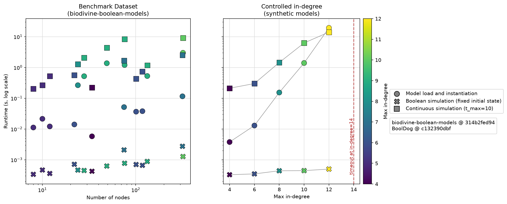

# Performance characterisation of BoolDog

This benchmarks BoolDog runtime (model load and instantiation, Boolean simulation, continuous/ODE simulation)  across (i) overall network size (**node count**) and (ii) regulatory **in-degree**. 


- **Node count:** models sampled across a wide size
  range (4-853 nodes) from
  [biodivine-boolean-models](https://github.com/sybila/biodivine-boolean-models),
  a curated repository of real-world Boolean network models.
- **In-degree:** a controlled synthetic single node with increasing
  in-degree, reproducing the exact clause pattern from a known pyboolnet
  performance issue
  ([hklarner/pyboolnet#122](https://github.com/hklarner/pyboolnet/issues/122)).

### Results



Runtime is driven far more by a single node's in-degree
than by total node count. A network can have hundreds of nodes and stay
fast if every node's in-degree stays low (~10 or under); a handful of
high-in-degree nodes can make an otherwise-small network intractable.
Boolean simulation from a fixed initial state stays negligible regardless
of either axis; continuous simulation scales with node count *and*, like
model load, with in-degree.

Detailed results are in the results folder. 

## Usage

### Test models

`biodivine-boolean-models`'s model files are fetched on demand (into
`data/`, gitignored) rather than committed to this repository. Only
`benchmark.py run` (or `python -c "from models import fetch_all; fetch_all()"`)
downloads them, resolving `main` to a concrete commit SHA at fetch time so
every file in one run comes from the same snapshot; the resolved commit
is recorded in `data/biodivine_commit.txt` and copied into
`results/biodivine_commit.txt` alongside the BoolDog commit
(`results/booldog_commit.txt`) used for that run, so results stay
traceable even though the fetch itself always tracks upstream rather than
pinning a commit in this file.

### Running

```bash
cd benchmarks
python benchmark.py run    # fetch models, run both sweeps -> results/*.tsv
python benchmark.py plot   # -> results/figures/scaling.png
python benchmark.py all    # both, in order
```

Each data point runs as its own subprocess with a wall-clock timeout
(`TIMEOUT_S` in `benchmark.py`, currently 180s), so one pathologically
slow high-in-degree model doesn't block the rest of the sweep. The
in-degree sweep stops early on the first timeout, since each step is a
strictly higher in-degree and so at least as slow; the node-count sweep
runs every model regardless, since it deliberately mixes low- and
high-in-degree models at similar sizes (a timeout there says nothing
about later, differently-shaped models). Timeouts are recorded (`error`
column), not silently dropped.

Plotting requires `seaborn`/`matplotlib`/`pandas`, which aren't core
BoolDog dependencies (`pip install seaborn` if missing).

## Files

- `benchmark.py`: the main CLI: runs both sweeps and/or produces the plot.
- `models.py`: the curated real-model list, the synthetic in-degree
  generator, and the model-fetching logic.
- `bench_worker.py`: benchmarks a single bnet model (read from stdin);
  run as a subprocess so `benchmark.py` can bound it with a timeout.
- `results/` — TSVs, commit-provenance files, and `figures/scaling.png`
  (committed); `data/` (fetched model files, gitignored).
